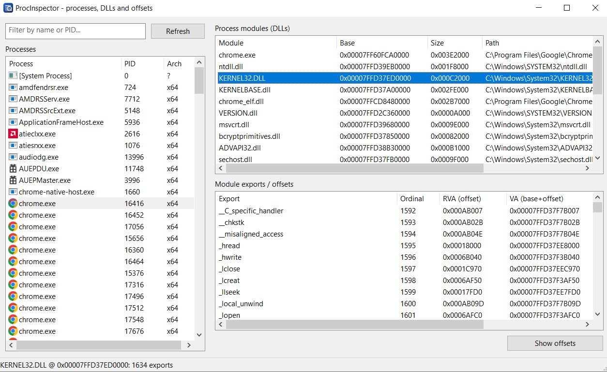

# ProcInspector

Native Win32 application (Unicode, x64) for browsing processes, their loaded modules (DLLs) and export offsets.
No frameworks, no external dependencies — plain WinAPI.

<p align="center">
  
</p>

## Features

- **Process list** with icons taken from the executable, PID and architecture (x86/x64), filter by name or PID.
- **Process modules**: name, load base, image size, full path.
- **Exports of the selected module**: name, ordinal, **RVA (offset inside the module)**, **VA (base + offset)** and forward target.
- **Show offsets** — a window with a plain text dump of every offset in a monospaced font, with copy to clipboard.
- DPI-aware layout, button widths derived from their captions.

## Usage

1. Pick a process in the left list (filter by name or PID if needed).
2. The loaded DLLs appear in the top right list — pick one.
3. Its exports with offsets appear in the bottom right list.
4. **Show offsets** in the bottom right corner opens the text dump with a **Copy to clipboard** button.

## Build

```bash
build.bat
```

Requires MSVC Build Tools (the script targets VS 2022 Build Tools, the path to `vcvars64.bat` is on the first line of `build.bat`).
It generates `app.ico` if missing, compiles the resources with `rc` and links `build\ProcInspector.exe`.

Manual command:

```bash
cl /nologo /EHsc /std:c++17 /O2 /utf-8 /DUNICODE /D_UNICODE main.cpp build\app.res /link /SUBSYSTEM:WINDOWS
```

## Icon

`app.ico` is generated by `gen_icon.ps1` in 16/24/32/48/64/128/256 sizes and embedded into the executable through `app.rc`.
The same icon is used for the window and the taskbar. To redraw it:

```bash
powershell -ExecutionPolicy Bypass -File gen_icon.ps1
```

## How it works

- Processes and modules come from `CreateToolhelp32Snapshot` (`TH32CS_SNAPPROCESS`, `TH32CS_SNAPMODULE | TH32CS_SNAPMODULE32`).
- Process icons come from `SHGetFileInfoW` + `ImageList`, the executable path from `QueryFullProcessImageNameW`.
- Exports: the DLL file is mapped into memory (`CreateFileMapping` / `MapViewOfFile`) and its PE header is parsed —
  `IMAGE_DIRECTORY_ENTRY_EXPORT`, the `AddressOfFunctions` / `AddressOfNames` / `AddressOfNameOrdinals` tables,
  with RVA translated to a file offset through the section table. PE32 and PE32+ are supported, forwarded exports are detected.
- Memory of other processes is never read or modified — only the module file on disk is read.
- `SeDebugPrivilege` is enabled at startup.

## Limitations

- x64 build: modules of 32-bit processes are visible through `TH32CS_SNAPMODULE32`, while protected processes
  (antivirus, System) never expose their module list.
- Some system processes require running as administrator — the reason is shown in the status bar.
- VA is computed as "module base in the process + RVA", i.e. an address in the address space of the selected process.

## Files

| File | Purpose |
| --- | --- |
| `main.cpp` | the whole application |
| `app.rc` | resources: icon and version info |
| `gen_icon.ps1` | `app.ico` generator |
| `build.bat` | build script |
